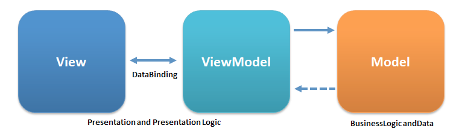
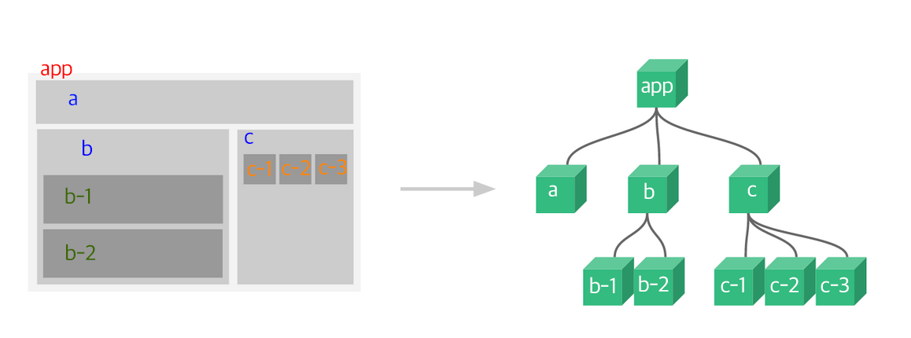
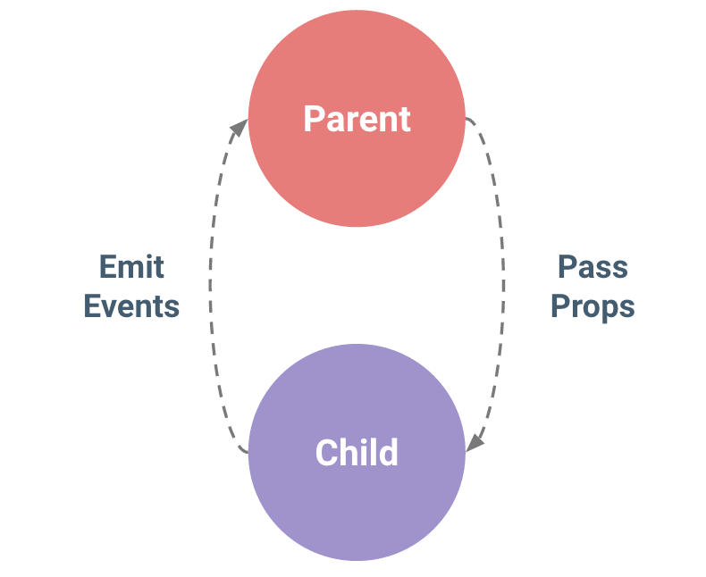
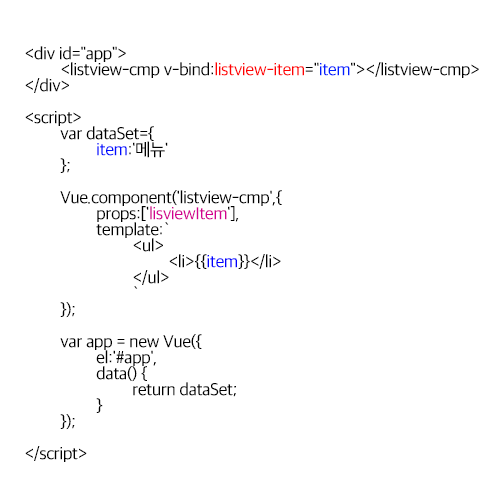
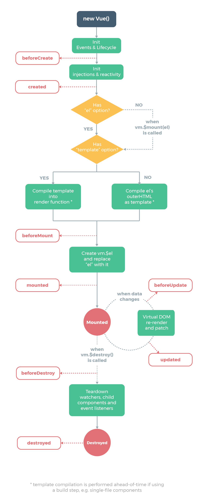

# VueJS Basic Example

# Vue Basic - example

## **학습한 강좌의 커리 큘럼**

: 누구나 다루기 쉬운 Vue.js 프론트 개발 - 3시간 안에 배우기

[https://www.inflearn.com/course/vue-pwa-vue-js-기본/#course-curriculum](https://www.inflearn.com/course/vue-pwa-vue-js-%EA%B8%B0%EB%B3%B8/#course-curriculum)

## 설명

동영상 강의만 보고, 직접 만들지 않으면 와닿지 않을 것 같아서 

거창하지 않으면서 익힐 수 있는 사이트 예시를 만들어보았습니다.

## 목표

**"최대한 Vue관련 서적을 읽지 않고 만들어보자."**

다른 프레임워크에 비해 진입 장벽이 낮기도하고...

'새로운 언어가 나올 때마다 책을 사는건 비효율적이지 않은가?'라는 생각에서 부터 시작하여

'공식 홈페이지의 문서를 보는 습관 기르기'

'스택오버플로우, 갓구글님과 더욱 친해지기'

'개념과 원리에 기반하여 익혀보기'

위해 최대한 책의 힘을 빌리지 않고, 동영상 강의, 캡틴 판교의 블로그, 구글링으로만 만들어 보기로 하였습니다.

(개념은 동영상, 캡틴 판교의 블로그에서 학습함.)

## **개념**

- MVVM 패턴이란?

( [이미지 출처](https://en.wikipedia.org/wiki/Model%E2%80%93view%E2%80%93viewmodel#/media/File:MVVMPattern.png) )

1) 화면에 일어나는 행동을 뷰가 감지하면 (View→ViewModel)

2) 뷰모델은 모델에게 스크립트 단에 내려다 주고 (ViewModel→Model)

3) 모델은 스크립트에 반응하여 화면에 보여지고 (Model→ViewModel) 

3) 뷰내부적으로 컴파일레이션으로 구현을 해줌.(ViewModel→View)

⇒ 화면 UI코드와 백엔드 데이터 처리 코드를 분리하여 화면, 뷰, 데이터 모델 단을 구분해서 사용할 수 있게함.

- Vue의 정의 및 특징

1) 작은 화면단 라이브러리 역할부터 큰 규모의 웹 애플리케이션 개발을 돕는 프레임워크 역할 까지 점진적으로 적용할 수 있는 프론트엔드 프레임워크

2) MVVM패턴을 사용

3) 리액트와 앵귤러의 장점을 흡수함.

앵귤러 - 양방향 바인딩 기능 흡수⇒ 화면과 스크립트의 데이터를 항상 동기화

리액트 - 버츄얼 돔 기능을 흡수하여 변화가 있는 DOM만 변경이 되도록하여 브라우저의 리소스를 감소함.

- 인스턴스

레고판처럼 레고판이 깔리면 조립을 할 수 있듯, 뷰로 화면을 개발할 때 필수로 생성해야 하는 단위.

거의 하나만 사용됨.

    var dataSet={
    	message:'hello'
    };
    var vm = new Vue({
    	el : '#app', // 인스턴스가 뿌려질 엘리먼트
    	template: '
{{message}}
' // 인스턴스의 화면 내용
    	data () { // 인스턴스가 갖는 데이터
    		return dataSet
    	},
    	methods:{ // 인스턴스의 이벤트 정의
    			sum (a,b) {
    				return a+b; 
    			}
    	},
    	created() { // 인스턴스 라이프 사이클
    		console.log('hello');
    	}
    });

⇒ data는 함수로 꼭 작성을 해야함.

    var vm = new Vue({
    	el : '#app'
    	data () { // 인스턴스가 갖는 데이터
    		return {message:'hello'}
    	}
    });

⇒  (X) 모든 컴포넌트가 같은 값을 공유하게 되므로 위의 방법으로 작성

- 컴포넌트

레고 블럭처럼 화면을 구조적으로 설계하기 위한 요소

뷰의 단위를 쪼개어 재활용이 가능한 형태로 관리하는 것

([이미지 출처](https://kr.vuejs.org/images/components.png?_sw-precache=7769fd61a903797e4273c74888ed8b9b))

전역 컴포넌트와, 로컬 컴포넌트가 있음.

    // 전역 컴포넌트 : 컴포넌트를 뷰 인스턴스에 등록해서 사용할 때 사용
    Vue.component('cardview-cmp',{
    	template:'
카드뷰
, // 인스턴스의 화면 내용
    	data:'' // 인스턴스가 갖는 데이터
    	methods: '',
    	created : ''
    });
    
    // SmallCmp 로컬 컴포넌트 선언
    var SmallCmp = {
    	template:'
small
'
    };
    
    // 로컬 컴포넌트
    var vm = new Vue({
    	el : '#app', // 인스턴스가 뿌려질 엘리먼트
    	template: '' // 인스턴스의 화면 내용
    	data () { // 인스턴스가 갖는 데이터
    		return dataSet
    	},
    	methods:{ // 인스턴스의 이벤트 정의
    			sum (a,b) {
    				return a+b; 
    			}
    	},
    	components: { // 로컬 컴포넌트 정의
    		'small-cmp': SmallCmp
    	},
    	created() { // 인스턴스 라이프 사이클
    		console.log('hello');
    	}
    });

⇒ 속성들이 el을 제외하고 인스턴스랑 같음.

    

    	<cardview-cmp></cardview-cmp>
    	<small-cmp></small-cmp>
    

- 컴포넌트 통신

( [이미지 출처](https://kr.vuejs.org/images/props-events.png?_sw-precache=a18498cd0176946ccee943d2fec4f420) )

1) 구조상 상-하 관계에 있는 컴포넌트 통신은

부모에서 자식으로 props를 down 하고, 자식에서 부모로 events up을 함.

모든 컴포넌트는 각 컴포넌트 자체의 스코프를 가짐.

하위 컴포넌트가 상위 컴포넌트의 값을 바로 참조할 수 없음.

    

    	<listview-cmp v-bind:listview-item="item"></listview-cmp>
    

    
    

    

    	<listview-cmp v-bind:listviewItem="item"></listview-cmp>
    

    
    

⇒ (X) js에서 props변수 명명을 카멜기법으로 하면 html에서 접근은 케밥기법(-)으로 가야함. 첫번째 코드 형태로 작성!!

같은 색이 칠해진 것을 구분하여 기억해두기!!

2) 같은 레벨의 컴포넌트 통신

동일한 상위 컴포넌트를 가진 2개의 하위 컴포넌트 간의 통신은 

'Child(하위) → Parent(상위) → 다시 2개의 Children(하위)'순으로 이루어짐. 

컴포넌트 간의 직접적인 통신은 불가능하도록 되어 있는게 Vue의 기본 구조

3) Event Bus

Non-Parent-Child 컴포넌트 간의 통신을 위해 Event Bus를 활용할 수 있음.

- 라우터

레고 블럭의 조립처럼 여러 개의 화면 간에 이동하는 방법을 말함.

Named Router, Nested Router 가 있음.

1. Nested Router

특정 URL에서 1개의 컴포넌트에 여러 개의 하위 컴포넌트를 갖는 것.

    var Main = {template:'
메인 페이지
'};
    var Error = {template:'
404
'};
    var router = new VueRouter({
    	routes : [
    		{
    			path:'',
    			component:Main
    		},
    		{
    			path:'404',
    			component:Error
    		}
    	]
    });
    
    var app = new Vue({
    	el:'#app',
    	router:router
    });

    

    	<router-link to="">메인</router-link>
    	<router-link to="/error">에러</router-link>
    	<router-view></router-view>
    

렌더링 되는 컴포넌트의 구조는 가장 큰 상위의 컴포넌트가 하위의 컴포넌트를 포함하는 Parent-Child형태와 같음.

: app(상위)  > Main 컴포넌트

: app(상위) > Error 컴포넌트

    var Main = {
    template :`
    	
메인 페이지

    	<article>메인 페이지2</article>
    `};

⇒ (X) Vue의 Template에 최상위 태그가 1개만 있어야 렌더링이 가능함, 여러 개의 태그를 최상위 태그에 동시 위치시킬 수 없음. 

    var Main = {
    template :`
    	
메인 페이지

    	<router-view></router-view>
    `};

⇒ (X) 기존에 렌더하는 태그 안에 router-vie를 사용하지 않고 밖에 넣었을 때 에러가 발생함., 최상위 엘리먼트는 한 개만 지정 해야함.

2. Named Router

특정 URL에서 여러 개의 컴포넌트를 쪼개진 뷰 단위로 렌더링 하는 것

    var Body = {template:'
Body
'};
    var AppHeader = {
    	template:`
    		<ul>
    			<li>메뉴1</li>
    			<li>메뉴2</li>
    			<li>메뉴3</li>
    		</ul>
    	`
    };
    var Error = {template:'
error
'};
    var router = new VueRouter({
    	routes : [
    		{
    			path:'',
    			components:{
    				nestedHeader:AppHeader,
    				default:Body
    			}
    		},
    		{
    			path:'404',
    			component:Error
    		}
    	]
    });
    
    var app = new Vue({
    	el:'#app',
    	router:router
    });

    

    	<router-view name="nestedHeader"></router-view>
    	<router-view></router-view>
    

- vue동작원리

뷰 인스턴스를 생성하고, 거기에 컴포넌트를 만들고, 템플릿 작업으로 화면을 구성함.

Reactivity여서 화면이 변하는 대로 바꿈.

model의 상태만 집중하면 됨.

vue라이브러리가 내부적으로 스크립트로 변환을 함!!

( [이미지 출처](https://kr.vuejs.org/v2/guide/instance.html) )

⇒ Vue객체가 생성될 때 '데이터 관찰', '템플릿 컴파일', 'DOM에 객체 연결', '데이터 변경 시 DOM 업데이트' 초기화 작업을 수행함.

⇒ Vue.js 템플릿 코드가 render함수를 사용하여 렌더를 하고 DOM 트리에 요소를 추가함.

⇒ 라이프 사이클 단계에 따라 mounted, updated, destroyed 등을 사용할 수 있는데 이 라이프 사이클 초기화 메서드로 커스텀 로직을 수행하기 때문에 Vue에서는 따로 Controller를 갖가 있지 않음.

** Vue vs Jquery

Jquery : 실제 돔트리를 지움.

Vue : VirtualDOM을 사용함.

(⇒ **브라우져 렌더링 관련 정리 필요**)

(2018.10.12 ~ 2018.10.15의 결과물에 적용이 되어 있음)

---

- Vue 리소스

- Vue 템플릿

- Vue 데이터 바인딩

- Vue 싱글파일 컴포넌트 체계

- Vue CLI를 이용한 프로젝트 구성

- Vue Loader

## ENVIRONMENT

- **UI framework**

    : [https://www.creative-tim.com/](https://www.creative-tim.com/)

- **Language**

    : HTML,CSS,JS, Vue.js

- **FILE STRUCTURE**

    /css
    	- common.css                   ====> 별도의 css (현재는 미사용)
    
    /js
    	- /vue
    		- vue.js                     =====> vue 라이브러리
    		- vue.rotuer.js              =====> vue router 라이브러리
    	- route.js                     =====> 2018.10.15 의 결과물 js
    
    /uiframework
    	- assets                       =====> UI Framework 라이브러리 파일들
    - route.html                     =====> 2018.10.15 의 결과물 js